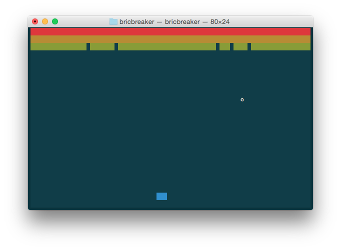

# bricbreaker
## Breakout clone written in C using ncurses

### Installation/Playing
* Make sure you have ncurses installed.
* Clone this repo, cd into it.
* `make` to compile and `./bricbreaker` to execute.
* Use left and right arrows to move paddle.
